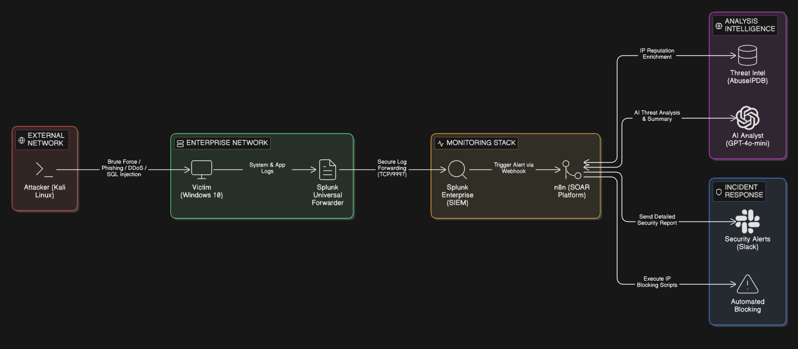
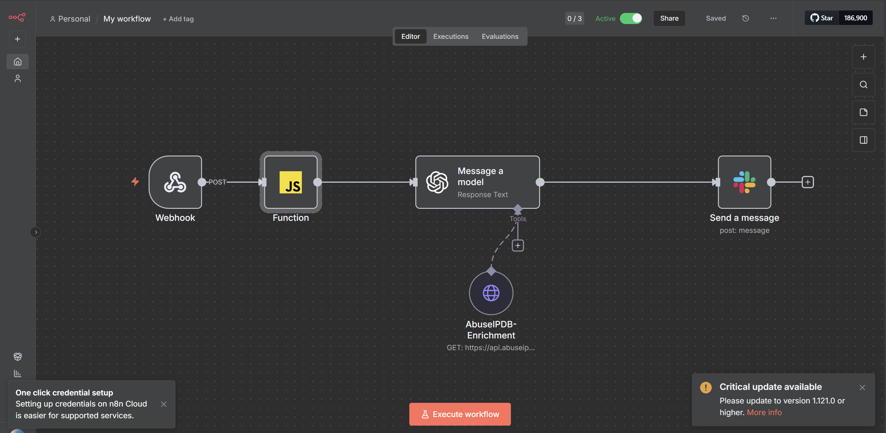
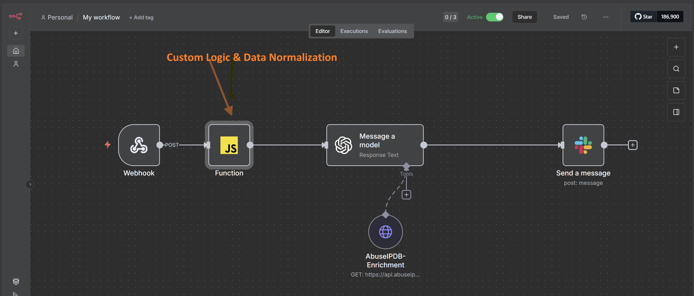

# AI-Powered SOC Automation & Incident Response System

## 🌟 Overview
This project focuses on building an automated Security Operations Center (SOC) system to address the challenges of manual incident response. By integrating **SIEM (Splunk)**, **SOAR (n8n)**, and **Generative AI (GPT-4o-mini)**, the system automates alert triage, data enrichment, and response recommendations.

**Key Achievement:** This project was awarded a **9.1/10** score for the Graduation Thesis at University of Information Technology (UIT).

## 🚀 Key Features
- **Automated Triage:** Automatically filters and categorizes security alerts from Splunk.
- **AI-Driven Analysis:** Utilizes LLM (GPT-4o-mini) to act as a Tier 1 Analyst, providing context-aware analysis and remediation steps.
- **Real-time Notifications:** Instant alerts and detailed reports sent via **Slack** for the security team.
- **Advanced Threat Detection:** Successfully detects and responds to Brute Force, Malware, and DDoS attacks and CIC-IDS dataset.

## 🛠 Tech Stack
- **SIEM:** Splunk Enterprise
- **SOAR:** n8n (Workflow Automation)
- **AI Model:** OpenAI API (GPT-4o-mini)
- **Monitoring:** Windows Event Logs, Sysmon
- **Testing Tools:** Kali Linux (Hydra, Villain, hping3)

## 📊 Performance Results
The system demonstrated significant efficiency improvements compared to manual processes:
- **MTTR (Mean Time To Respond):** Reduced from ~15 minutes to **9.3 seconds**.
- **Detection Accuracy:** Achieved **99.7%** accuracy on the CIC-IDS-2017 dataset.
- **Scalability:** Successfully handled 68 concurrent DDoS alerts within 15 seconds.

## 🏗 System Architecture

## 🏗  System Workflow
1.  **Ingestion:** Splunk collects logs from Endpoints (Windows/Sysmon).
2.  **Detection:** Alert rules in Splunk trigger a Webhook when suspicious activity is detected.
3.  **Normalization:** The `data-normalization.js` script inside n8n cleans and formats the raw alert data.
4.  **AI Analysis:** GPT-4o analyzes the normalized data to determine the threat level and provide remediation steps.
5.  **Notification:** A structured, high-context alert is sent to a specific Slack channel based on the attack type.

## 🧠 Custom Logic & Data Normalization in n8n
To ensure the AI and the security team receive clean, structured data, I implemented a custom JavaScript processor within n8n.

Key functions of the script:

Data Normalization: Standardizes field names (IP, Hostname, Severity) from different log sources.

Dynamic Routing: Automatically routes alerts to specific Slack channels based on the Alert ID (e.g., #alert-brute-force, #alert-ddos).

Context Enrichment: Prepares raw data for the LLM (GPT-4o) to analyze.

📂[ View the full script here ](./scripts/data-normalization.js)

## 🤖 AI Prompt Engineering (Tier 1 Analyst Persona)
To ensure high-quality analysis, I designed a structured prompting strategy for the OpenAI GPT-4o-mini engine:

**System Role (The Expert Instruction):**
> "As a Tier 1 SOC analyst assistant. When provided with a security alert or incident details (including indicators of compromise, logs or metadata), perform the following steps without duplication or irrelevant analysis. Classify the alert based on the provided Attack Type and details (e.g., Event Codes, Ports) to tailor your response uniquely for each type, ensuring the Tier-1 analyst can immediately identify the attack (e.g., brute-force RDP, malware reverse shell, DDoS SYN flood, or legacy CIC-IDS event).

1. Summarize the alert – Provide a clear, concise summary of what triggered the alert, affected systems/users, and nature of activity. Tailor to alert type:
- For "Brute Force Attempt (Network/Auth Level)" (EventCode=4625 or 5156, Destination_Port=3389): Highlight failed login attempts (>15 in 5m), source IP, and RDP target.
- For "Malware Execution (Reverse Shell)" (EventCode=4104): Analyze suspicious PowerShell script (e.g., hidden window, TCPClient/WebClient/iex for reverse shell).
- For "SYN Flood DDoS" (EventCode=5156, connection_count >500 in 10s): Note high connection volume from source IP to non-Splunk ports (!=9997).
- For CIC-IDS legacy events (EVENT=CIC_IDS_SIM): Reference ATTACK_TYPE, SRC_IP/DST_IP, as informational simulation.

2. Enrich with threat intelligence – Correlate IOCs (IPs, domains, hashes) with known sources. Use 'AbuseIPDB-Enrichment' data (provided in context) only if IP is available and relevant. Skip for non-IP alerts:
- Brute-force/DDoS/CIC-IDS: Enrich source IP if present, highlight associations with malware/threat actors and the Abuse Confidence Score.
- Malware (EventCode=4104): Skip IP enrichment; focus on script patterns instead.

3. Assess severity (Dynamic Logic) – Map to MITRE ATT&CK tactics/techniques without overlap. Provide/adjust severity (Low/Medium/High/Critical) with reasoning.
CALCULATION LOGIC: Final_Severity = MAX(Base_Severity, Threat_Intel_Modifier)
- Brute-force: T1110 (Credential Access). Start with HIGH if attempts >15. 
    * UPGRADE to CRITICAL if Abuse Confidence Score > 80% or IP is a Tor Exit Node.
- Malware: T1059 (Command and Scripting Interpreter). Start with CRITICAL if reverse shell indicators are found.
- DDoS: T1498 (Network Denial of Service). Start with HIGH if volume is high. 
    * UPGRADE to CRITICAL if multiple sources are identified or Abuse Score is extreme.
- CIC-IDS: Informational, map based on ATTACK_TYPE (e.g., T1498 for DoS simulations). 
    * DOWNGRADE to Informational if the Label is BENIGN or IP is in a known Whitelist.

REASONING: Explain clearly why you chose or adjusted the severity level based on the logic above.

4. Recommend next actions – Base recommendations directly on MITRE ATT&CK mitigations for the mapped technique, tailoring to the alert without generic advice. Include detection, prevention, and response steps:
- For T1110 (Brute Force): 
    * Detection: Monitor failed logons/high attempts.
    * Prevention: Implement account lockout after failed attempts, use MFA, follow NIST password guidelines.
    * Response: Reset compromised accounts, block IP via firewall.
- For T1059.001 (Malware, EventCode=4104): 
    * Detection: Monitor behavioral chains (unusual processes/network from PowerShell).
    * Prevention: Enforce code signing (signed scripts only), disable PowerShell if unnecessary, use Constrained Language mode.
    * Response: Isolate host, terminate processes, collect logs (command history/Base64), remove persistence (registry keys).
- For T1498 (DDoS): 
    * Detection: Monitor large outbound traffic/flood tools.
    * Prevention: Use ISP/CDN for traffic filtering, block targeted ports/protocols.
    * Response: Block source IPs, implement disaster recovery plan.
- For CIC-IDS (based on ATTACK_TYPE): Use general MITRE mitigations (e.g., for DoS simulations, same as T1498), but keep informational with no urgent actions.

Format output clearly in Markdown for Slack."

**User Role (The Dynamic Data Input):**
>Alert: {{ $json.search_name }}
Type: {{ $json.attack_type }} (CIC-IDS: {{ $json.attack_type_cic }})
Initial Severity: {{ $json.severity }}
IP Address: {{ $json.ip_address }} (enrich if applicable)
Computer/Host: {{ $json.computer_name }}
Time: {{ $json.time }}

Key Details:
Failed Attempts (Brute Force): {{ $json.attempts }}
Connection Count (DDoS): {{ $json.connection_count }}
PowerShell Script/Message (Malware): {{ $json.message }}
Raw Log for Reference: {{ $json.raw_details }}
Slack Channel Name: {{ $json.channel_name }}

## 📁 Repository Structure & Components

I have organized this repository to reflect a professional SecOps environment. Below is the breakdown of each directory and its function:

### 📂 assets/
Contains visual documentation of the project’s monitoring and alerting capabilities.
* `architecture.png`: High-level diagram showing the data flow between Splunk, n8n, and OpenAI.
* `splunk-dashboard-alerts.png`: **Main Security Dashboard** providing an overview of all detected security events and system health.
* `splunk-dashboard-alerts01.png`: **Brute Force Detection View** showing failed login attempts (Windows Event ID 4625) captured from the victim's machine.
* `splunk-dashboard-alerts02.jpg`: **Malware Activity Monitoring** visualizing suspicious PowerShell execution and unauthorized file modifications.
* `splunk-dashboard-alerts03.png`: **DDoS Attack Analysis** illustrating traffic spikes and SYN flood patterns detected in real-time.
* `splunk-dashboard-alerts04.jpg`: **CIC-IDS-2017 Dataset Integration** showing the validation of the AI model against international standard datasets.
* `slack-alert.png`: **AI-Generated Incident Report** - a sample of the high-context notification sent to Slack via n8n.

### 📂 `deployments/`
Infrastructure-as-Code (IaC) for system deployment.
* `docker-compose.yaml`: Orchestration file to quickly spin up the n8n automation engine and its environment.

### 📂 `siem-configs/`
Configuration files for the SIEM layer (Splunk).
* `inputs.conf`: Defines data ingestion rules for Windows Event Logs and attack simulation datasets. Locate at Victim Machine: C:\Program Files\SplunkUniversalForwarder\etc\system\local 

### 📂 `scripts/`
Custom scripts for logic processing and security testing.
* `n8n-logic/data-normalization.js`: Custom JavaScript used inside n8n to standardize incoming log data before AI analysis.
* `ingest_samples.py`: Python script to feed test data (CIC-IDS-2017) into the SIEM.
* `auto_attack.sh`: Bash script to simulate Brute Force and DDoS attacks for testing.

### 📂 `docs/`
* `Thesis_Summary.pdf`: A detailed summary of the research methodology, experimental results, and conclusion.

---

